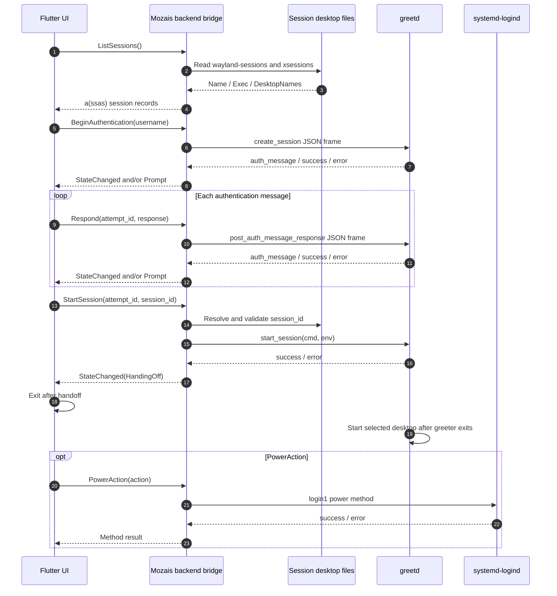
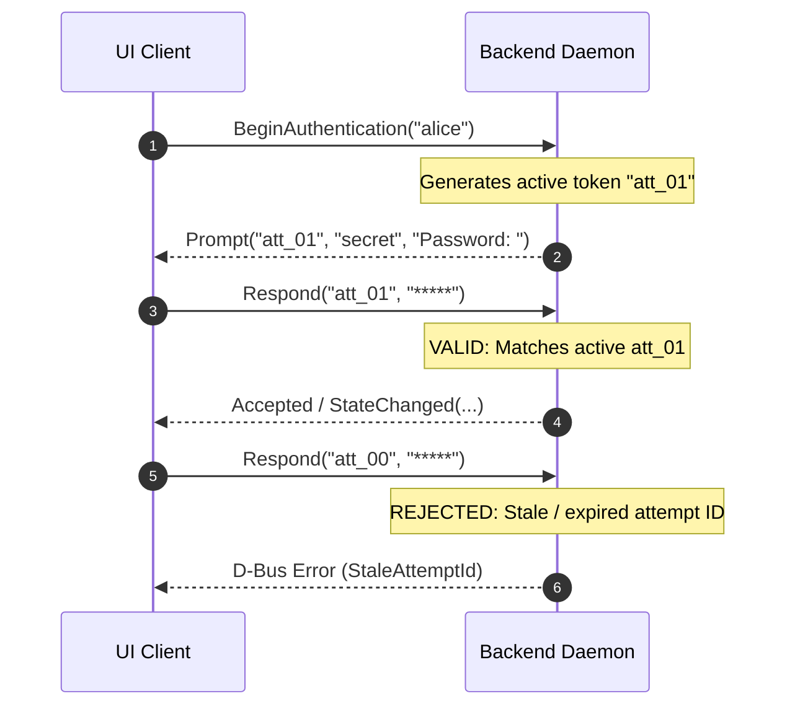
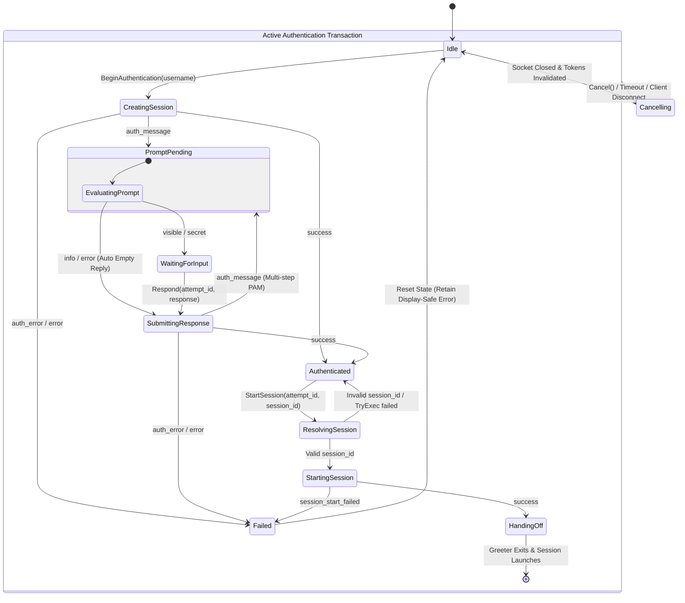

# System Architecture & D-Bus Contract Specification

This specification defines the inter-process communication (IPC) boundaries, state machine invariants, security policies, and technical implementations for the **Mozais Greeter** backend-frontend abstraction layer.

---

## 1. System Architecture & Component Separation

The architecture decouples the user interface (Flutter client) from underlying system daemons (`greetd` and `systemd-logind`) using a dedicated, unprivileged backend bridge.

```text
┌───────────────────────────────────────────────────────────┐
│                    Flutter UI Client                      │
│            (Unprivileged / Non-root User)                 │
└─────────────────────────────┬─────────────────────────────┘
                              │
                              │ Private / Session D-Bus
                              │ Bus: io.mozais.Greeter
                              │ Interface: io.mozais.Greeter1
                              ▼
┌───────────────────────────────────────────────────────────┐
│              Mozais Backend Bridge Daemon                 │
│         (Translates D-Bus Calls to greetd / System)       │
└──────────────┬─────────────────────────────┬──────────────┘
               │                             │
               │ Unix Domain Socket          │ System D-Bus
               │ 32-bit native-endian      │ (org.freedesktop.login1)
               │ length + UTF-8 JSON       │
               ▼                             ▼
┌─────────────────────────────┐   ┌─────────────────────────┐
│           greetd            │   │     systemd-logind      │
│   (PAM Authentication)      │   │   (Power Management)    │
└─────────────────────────────┘   └─────────────────────────┘
```

### Communication Flow

The component diagram above shows ownership boundaries. The following sequence diagram details the runtime communication path. Session desktop files are read locally by the backend daemon; they do not constitute a separate IPC endpoint.



For `info` and `error` authentication messages, the backend emits the prompt for display and may submit an empty response automatically. For `visible` and `secret` messages, it must wait for the UI response. The loop must not assume that there is only one password prompt.

### Key Architectural Benefits
* **Framework Isolation**: The Flutter frontend remains strictly agnostic of Unix domain sockets, PAM message formats, binary frame packing, and `systemd` DBus interfaces.
* **Testability**: A separate mock backend build (`cargo run --features mock`) can be used on a private D-Bus session (`dbus-run-session`), allowing complete UI development and automated integration testing without running a real `greetd` daemon or requiring elevated privileges. The production build does not contain the mock transport and never selects it from a runtime environment variable.
* **Least Privilege Enforcement**: The UI runs as an unprivileged client with zero direct access to root or system-level control interfaces.

### Concurrency Model

Authentication is owned by one actor. D-Bus state-changing methods enqueue commands and await a per-call reply; the actor exclusively owns `AuthStateMachine`, the active `GreetdTransport`, cancellation handles, caller ownership, and the power-action reservation. `GetState()` reads a `watch` snapshot and does not contend with greetd I/O.

The actor processes one authentication command at a time, so a greetd request and its state transition cannot overlap with `Respond()`, `Cancel()`, or a replacement `BeginAuthentication()`. Session catalog scans remain outside the actor on blocking worker tasks; their completion is committed only if the attempt ID is still current. This is the stale-result boundary for catalog work and removes the need for backend, operation, transport, and request-gate locks.

---

## 2. Interface Specification: `io.mozais.Greeter1`

### Service Coordinates
* **Bus Name**: `io.mozais.Greeter`
* **Object Path**: `/io/mozais/Greeter`
* **Interface**: `io.mozais.Greeter1`

---

### Methods Specification

#### Query Operations

##### `GetState() -> (String state, String detail)`
* **Description**: Returns the current state of the backend authentication engine.
* **Returns**:
  * `state`: The current authentication phase (e.g., `Idle`, `CreatingSession`, `WaitingForInput`, `Authenticated`).
  * `detail`: Additional status metadata or display-safe error text.
* **Wire Signature**: `ss`

##### `ListUsers() -> Array<Struct<String, String, String>>`
* **Description**: Enumerates system users available for interactive login.
* **Returns**: Array of user records containing `username`, `display_name`, and `icon_path`.
* **Wire Signature**: `a(sss)`

##### `ListSessions() -> Array<Struct<String, String, Array<String>>>`
* **Description**: Parses and returns available Wayland and X11 sessions from `/usr/share/wayland-sessions` and `/usr/share/xsessions`.
* **Returns**: Array of session records containing `session_id`, `name`, and `desktop_names` (e.g., `["sway", "wlroots"]`, `["Hyprland"]`).
* **Wire Signature**: `a(ssas)`

---

### Session Discovery and `DesktopNames` Data Model

Each session record represents one desktop entry file, not a running compositor. The backend retains and validates the following internal fields:

```text
session_id     Stable identifier, e.g., "wayland:sway"
session_type   "wayland" or "x11"
name           User-facing Name= value from .desktop entry
exec           Parsed Exec= argv array, backend-owned and sanitized
desktop_names  DesktopNames= split on ';', preserving specified order
available      Boolean indicating whether TryExec and binary checks pass
source         Absolute desktop entry file path
```

`DesktopNames` is a semicolon-separated list of desktop environment identifiers from the desktop entry (e.g., `DesktopNames=sway;wlroots`). This describes a single Sway session with two fallback environment identifiers. It does not request multiple compositors.

`session_id` must remain distinct from `desktop_names`: two separate desktop entries may refer to the same compositor while supplying different wrapper scripts or environment variables. The UI receives `session_id`, `name`, and `desktop_names`, while the backend maintains sole ownership over the parsed `Exec` vector and constructs the final `cmd` and `env` parameters for `greetd`.

The backend may normalize or override desktop metadata to handle compatibility issues. Display-only overrides remain in the UI layer. Changes affecting the launched environment must be represented as a validated backend profile, rather than an arbitrary command or environment map supplied by the UI.

This discovery step identifies available session candidates; it does not guarantee that the selected compositor will execute successfully. `greetd` accepts the `start_session` request and spawns the command after the greeter process exits.

---

#### Authentication Lifecycle Operations

##### `BeginAuthentication(String username) -> String attempt_id`
* **Description**: Initiates a PAM authentication transaction for the specified `username`.
* **Behavior**:
  * Invalidates any existing active authentication attempts.
  * Connects to the underlying `greetd` socket and transmits `create_session`.
  * Generates and returns a unique `attempt_id` (UUID v4 or monotonic token).

##### `Respond(String attempt_id, String response) -> Void`
* **Description**: Submits credential input (e.g., password or OTP token) for an ongoing PAM challenge.
* **Parameters**:
  * `attempt_id`: The transaction token returned by `BeginAuthentication`.
  * `response`: The plaintext response string (must be zeroed out in memory immediately after processing).

##### `Cancel(String attempt_id) -> Void`
* **Description**: Explicitly aborts an active authentication transaction.
* **Behavior**: Transmits `cancel_session` to `greetd` and resets the backend state machine to `Idle`.

##### `StartSession(String attempt_id, String session_id) -> Void`
* **Description**: Requests execution of the selected desktop environment upon successful PAM authentication.
* **Parameters**:
  * `attempt_id`: Valid token for a currently `Authenticated` session.
  * `session_id`: The identifier corresponding to a session entry returned by `ListSessions()`.
* **Selection Rule**: The backend resolves `session_id` against its internally verified session catalog. The UI is strictly prohibited from supplying arbitrary `Exec` strings.

---

#### Power Management Operations

##### `PowerAction(String action) -> Void`
* **Description**: Requests system power state transitions (`PowerOff`, `Reboot`, `Suspend`, `Hibernate`).
* **Behavior**: The backend proxies the request to `systemd-logind` via the System D-Bus (`org.freedesktop.login1`).

---

### Signals Specification

##### `Prompt(String attempt_id, String prompt_kind, String text)`
* **Description**: Emitted asynchronously when PAM requests user input.
* **Parameters**:
  * `attempt_id`: The associated authentication transaction token.
  * `prompt_kind`: Enum string indicating input type (`visible` for plain text, `secret` for passwords, `info` for informational notices, `error` for PAM errors).
  * `text`: The prompt string provided by PAM (e.g., `"Password: "`).

##### `StateChanged(String attempt_id, String state, String detail)`
* **Description**: Emitted when the authentication engine transitions between internal states.
* **Parameters**:
  * `attempt_id`: The associated authentication transaction token.
  * `state`: New authentication state string.
  * `detail`: Display-safe explanatory text or failure reason. Must never contain passwords or confidential payload data.

---

## 3. The `attempt_id` Transaction Design

To eliminate race conditions, stale UI responses, and replay attempts, all state-modifying authentication operations require a unique `attempt_id`.



### Protocol Invariants
1. **Single Active Transaction**: The backend permits **exactly one** active `attempt_id` at a time. Executing `BeginAuthentication` while another attempt is active automatically cancels the previous attempt.
2. **Stale Token Rejection**: Any `Respond()`, `Cancel()`, or `StartSession()` invocation carrying a mismatched or expired `attempt_id` is rejected immediately without forwarding commands to `greetd`.

---

## 4. Security Policies & Boundaries

### 1. Zero-Trace Secret Handling
* **No Logging**: Passwords, response tokens, and raw PAM secret prompts must never be written to stdout, stderr, persistent logs, or ephemeral debug logs (`/tmp/mozais-flutter.log`, `/tmp/sway-debug.log`).
* **No Signal Exposure**: Confidential user input must only traverse the unicast D-Bus method call `Respond()`. Secrets must never be emitted over D-Bus Signals.
* **Memory Wiping**: Secret buffers must be explicitly zeroed out in memory immediately after socket transmission (e.g., using `explicit_bzero` or `sodium_memzero`). Memory pages holding credentials should be marked with `MADV_DONTDUMP` to prevent leaks in crash dumps.

### 2. D-Bus Bus Segregation & Privilege Model
* **Session/Private Bus**: Used exclusively for UI-to-Backend IPC.
* **System Bus Isolation**: System actions (`PowerAction`) are routed across the System D-Bus to `systemd-logind`.
* **Polkit Authorization**: Power actions rely on Polkit policies residing in `/usr/share/polkit-1/actions/` to grant or restrict shutdown/reboot capabilities to the `greeter` user without requiring `sudo` or `setuid` binaries.
* **Unprivileged Backend Execution**: The backend daemon executes strictly under the unprivileged `greeter` system user account (belonging to groups `greeter`, `video`, `render`).

---

## 5. State Machine and Transitions

The backend daemon manages multiple orthogonal state domains. The primary public phase exposed via `GetState()` and `StateChanged()` represents the **`AuthState`**.

```text
ServiceState:  Starting ──► Ready ──► Unavailable ──► Reconnecting ──► Ready
                              │
                              └──► Stopping

CatalogState:  Empty ──► Loading ──► Ready
                           │
                           ├──► Refreshing ──► Ready
                           └──► Failure ──► Degraded / Empty

PowerState:    Idle ──► Authorizing ──► Executing ──► Succeeded / Failed
```

### 5.1 Primary `AuthState` Lifecycle Diagram

The state machine for a single `attempt_id` is defined below:



`PromptPending` messages of type `info` or `error` trigger a `Prompt` signal and automatically submit an empty response back to `greetd`. Messages of type `visible` and `secret` transition to `WaitingForInput`. The protocol loop may cycle through `PromptPending` multiple times during multi-factor or multi-step PAM challenges before reaching a terminal state.

---

### 5.2 Authentication Transition Rules

| Current State | Event or Guard Condition | Next State | Required Backend Action |
| :--- | :--- | :--- | :--- |
| `Idle` | Valid `BeginAuthentication(user)` | `CreatingSession` | Invalidate previous token, generate new `attempt_id`, open socket to `GREETD_SOCK`, send `create_session`. |
| `CreatingSession` | Receives `auth_message` | `PromptPending` | Parse prompt type and text; emit `Prompt` signal. |
| `CreatingSession` | Receives `success` | `Authenticated` | Maintain active `greetd` socket connection; await desktop selection. |
| `CreatingSession` | Receives `auth_error` or `error` | `Failed` | Record display-safe error description; close socket; invalidate transaction token. |
| `PromptPending` | `prompt_kind` is `visible` or `secret` | `WaitingForInput` | Await exactly one valid `Respond()` invocation for the matching `attempt_id`. |
| `PromptPending` | `prompt_kind` is `info` or `error` | `SubmittingResponse` | Emit prompt text to UI; automatically send empty `post_auth_message_response` to `greetd`. |
| `WaitingForInput` | Valid `Respond(attempt_id, resp)` | `SubmittingResponse` | Transmit `post_auth_message_response` over socket; zero out plaintext buffer immediately. |
| `WaitingForInput` | Stale token or invalid phase | *Unchanged* | Return a D-Bus error to caller; do not send data over `greetd` socket. |
| `SubmittingResponse`| Receives `auth_message` | `PromptPending` | Continue authentication loop for subsequent PAM challenges. |
| `SubmittingResponse`| Receives `success` | `Authenticated` | Transition to authenticated state; await `StartSession()`. |
| `SubmittingResponse`| Receives `auth_error` | `Failed` | Treat as retryable authentication failure; allow user to initiate new attempt. |
| `Authenticated` | Valid `StartSession(attempt_id, id)`| `ResolvingSession` | Resolve `session_id` against backend-owned session catalog. |
| `ResolvingSession` | Invalid or unavailable `session_id`| `Authenticated` | Reject call with D-Bus error; preserve `Authenticated` state to allow re-selection. |
| `ResolvingSession` | Valid `session_id` | `StartingSession` | Build sanitized `cmd` and `env` arrays from verified `.desktop` file. |
| `StartingSession` | Receives `success` | `HandingOff` | Emit `StateChanged("HandingOff")`; close D-Bus connection; terminate greeter process. |
| `StartingSession` | Receives `error` | `Failed` | Report `session_start_failed`; clean up socket state. |
| *Any Active State* | `Cancel()`, timeout, or UI disconnect | `Cancelling` | Transmit `cancel_session` to `greetd` if socket is open; invalidate token immediately. |
| `Cancelling` | Response received or socket closed | `Idle` | Clear prompt buffers, socket references, credentials, and transaction tokens. |
| *Any Active State* | Socket EOF, malformed JSON, or timeout | `Failed` | Close socket; discard transaction token; preserve structured, non-secret error. |

`Failed` is a terminal state for the active authentication transaction, not for the backend process. Upon completing cleanup, the backend returns to `Idle` holding a structured, display-safe `last_error` readable by the UI.

---

### 5.3 Transaction and Client Invariants

1. **Strict Atomicity**: At most one active authentication attempt exists at any time.
2. **Preemptive Cancellation**: Invoking `BeginAuthentication` automatically revokes and cancels any in-flight `attempt_id` before processing the new request.
3. **Signal Isolation**: Asynchronous signals carry generation tokens; signals matching expired tokens are discarded by the UI.
4. **Client Disconnect Handling**: Loss of the D-Bus client connection immediately triggers cancellation of the active transaction. A PAM prompt must never remain attached to a dead UI process.
5. **Failure Classification**: PAM `auth_error` responses represent retryable credential failures. Protocol, socket, or session execution failures require complete state cleanup before a new attempt can begin.
6. **Power Action Isolation**: `PowerAction` maintains an independent state domain. If an authentication transaction is active when a power request is received, the backend must either reject the power action as busy or explicitly cancel the authentication attempt prior to executing the system call.

---

## 6. Development Workflow & Client Implementation

### Mock Backend Strategy
For local UI development, build and run the backend with `cargo run --manifest-path backend/Cargo.toml --features mock`. The D-Bus integration wrapper `scripts/debug-dbus.sh` establishes a private session bus (`dbus-run-session`) and exports `MOZAIS_BUS_MODE=private`. `MOZAIS_BACKEND` is a Flutter UI setting only; it does not select the backend transport.

The mock backend implements the complete `io.mozais.Greeter1` interface specification without making system PAM calls or opening a `greetd` socket:

1. `ListUsers()` serves stubbed mock user data.
2. `ListSessions()` returns deterministic test session entries (Wayland and X11).
3. `BeginAuthentication()` instantiates a mock transaction and emits realistic `Prompt` signals.
4. `Respond()` validates against test credentials (e.g., matching `"password"`) and reproduces accurate success/failure transitions.

The helper scripts establish the execution environment and spawn the Flutter client. Full integration testing executes both the mock backend daemon and the Flutter UI client within the same isolated `dbus-run-session` instance.
